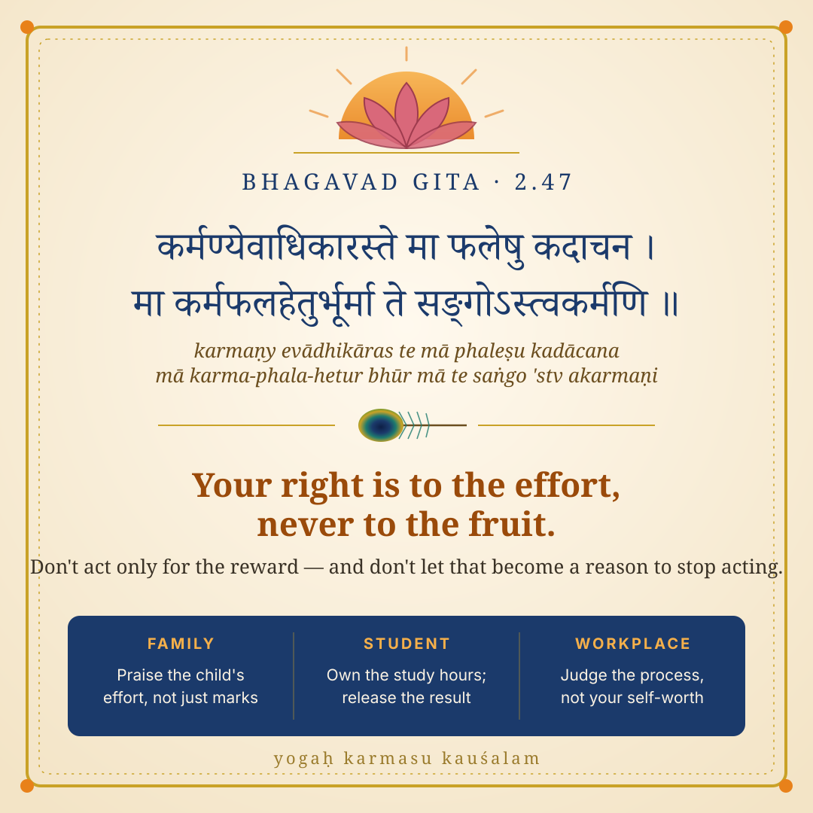

# Gita for Everyday Life

A curated, illustrated collection of the most widely acclaimed Bhagavad Gita shlokas
that help in daily life — with Sanskrit, meanings, applications for families,
students and working professionals, stories, and graphics.

- **Plan:** [PLAN.md](PLAN.md): sources, selection method, candidate list, visual theme, phases
- **Worked example:** [content/shlokas/02-47.md](content/shlokas/02-47.md)
- **Sample graphics:**
  - [Shloka card — 2.47](design/samples/card-2-47.svg)
  - [Ladder of Fall — 2.62–63](design/samples/ladder-of-fall-2-62-63.svg)

  
  

Sanskrit text is sourced from the public-domain [gita/gita](https://github.com/gita/gita) dataset.
